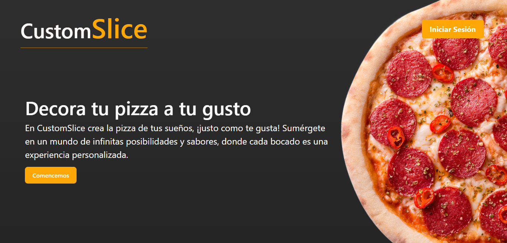
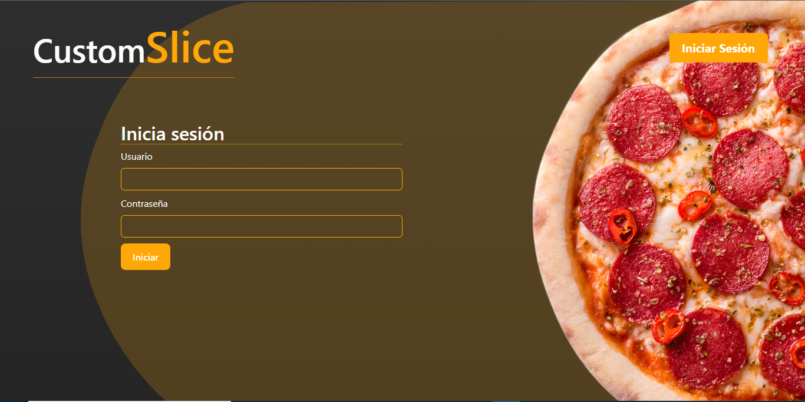
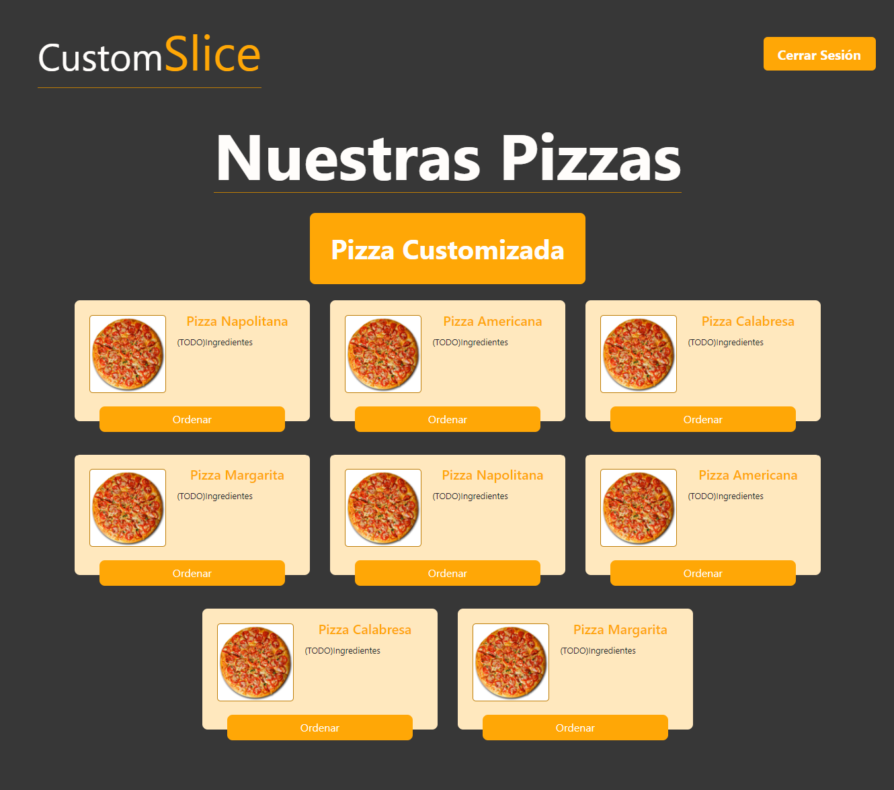
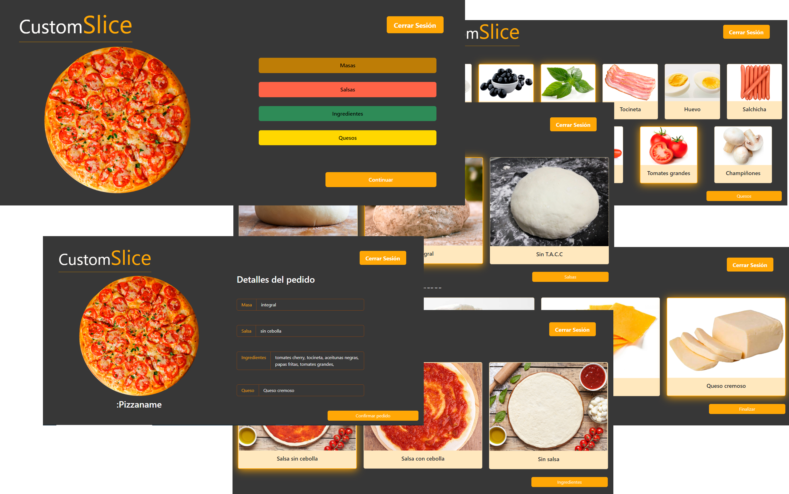
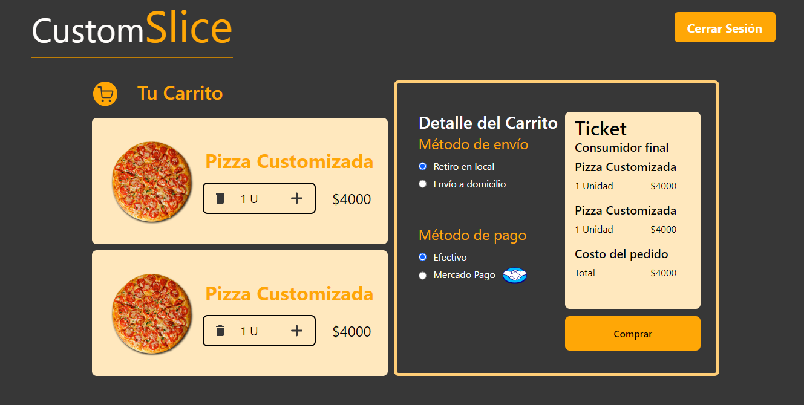

# CustomSlice

En CustomSlice podrás hacer tu pedido a tu medida, con las pizzas de siempre o mucho mejor, puedes personalizarlas con todos los ingredientes que quieras.
CustomSlice es una web e-commerce que te permite cargar tu pedido customizado y efectuar la compra.

## ¿Dónde puedo encontrar la web?

La web se encuentra ya disponible en [custom-slice.vercel.app](https://custom-slice.vercel.app/)

# MVP

Se planteó realizar un MVP de CustomSlice, el cual contendría las funcionalidades más atractivas y relevantes para el funcionamiento de la misma.

### Funcionalidades del **MVP**:
|**Login**|
|:---:|
|Interfaz en la cual un usuario puede loguearse e ingresar a la web CustomSlice.|
||

|**Pizzas predeterminadas**|
|:---:|
|Una vez logueado el usuario, llega a la pantalla donde se encuentran 8 pizzas predeterminadas, para que pueda elegir y ordenar.|
||

|**Pizzas personalizadas**|
|:---:|
|Si el usuario lo desea puede customizar sus pizzas a su gusto con los ingredientes que se encuentra en la web y así hacer su pedido mucho más personalizado.|
||

|**Carrito de compras**|
|:---:|
| Por último el usuario puede ver el estado de su compra/pedido, pudiendo ver las pizzas, sus costos, métodos de envio, costo final y métodos de pago, para finalmente despachar su pedido.|
||

## Arquitectura Web

|**COORDINACIÓN**||
|:---:|:---:|
||Para la organización utilizamos la metodología Ágil **Scrum**. Organizamos y planeamos los Sprint realizados, permitiéndonos llevar un control sobre las distintas actividades de los miembros del equipo y así coordinar los avance sobre el proyecto.|

Las actividades más relevantes Fueron:
- Captura de requerimientos. Se llevaron a cabo reuniones donde el Team Líder tomaba el Rol de Product Owner.
- Creación del Backlog.
- Planeación de Sprints.
- Asignación de tareas.
- - -

|**UI/UX**||
|:---:|:---:|
| |Para  la maquetación de Prototipos de pantallas y sus funcionalidades seutilizó **Figma**, el cual nos permitió visualizar la web en una primera instancia.|

Dentro del siguiente link se encuentra la preview del Prototipo Figma Desarrollado: [Figma_preview_CustoSliceWeb](https://www.figma.com/proto/yIK4I16eaDaP46HQnfiF7O/Untitled?type=design&node-id=14-3&t=8ErHT0aqxoBjOeus-0&scaling=scale-down&page-id=0%3A1)

- - -

|**FRONT END**||
|:---:|:---:|
| |La replicación de los prototipos en lenguaje aplicado se llevó a cabo utilizando el framework **React**. Se incorporó ruteo y Boostrap.|
- - -

|**QA**||
|:---:|:---:|
| |Se incorporó el testeo sobre las distintas etapas del proyecto, para esto se eligieron las tecnologías de **JUinit5**|

- - -

## Equipo de desarrollo

|**Team Lider**|**FrontEnd**|**UI/UX**| **QA**|**QA/UI/UX**|**Scrum Master/Project Manager/FrontEnd/UI/UX**|
|:---:|:---:|:---:|:---:|:---:|:---:|
|| | | | | |
|**Andrés Rodríguez**|**Tomás Nuñez Ingas**|**Luis David Rambao**|**Michellangela Sierra**|**Santiago Cisneros**|**Marina Caseres**|
| |  |  |  |  |  |  |

